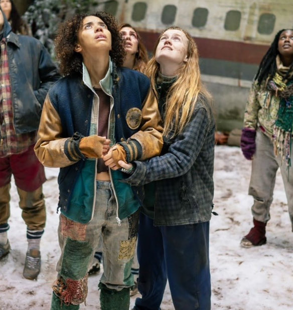

# test
For class exercise. 



## About Me & My Interests

| About Me | Information |
|----------|---------|
| Name | Kelly Sturgeon |
| Major/Focus | Library Sciences |
| Project interest | Indiana limestone carvers |
| Goal | Learning to organize and present digital content |

## Resources

a related item from another collection: [Carving Limestone, Indiana Limestone Company, Bedford, Indiana, October 1929](https://images.indianahistory.org/digital/collection/V0002/id/1706/)

## Sample Metadata

Here's an example of how metadata for a limestone carver item would be structured:

```json
{
  "title": "Indiana Limestone Carver",
  "date": "1920s",
  "description": "A craftsman carving limestone in Indiana",
  "subject": "Indiana limestone, sculpture, craftsmanship",
  "creator": "Jackson, Photographer, Bedford, Indiana"
}
```
## What I'm Learning About
* how to use CollectionBuilder and GitHub
* how to create a digital project using simple codes
* the history of Indiana limestone carvers
